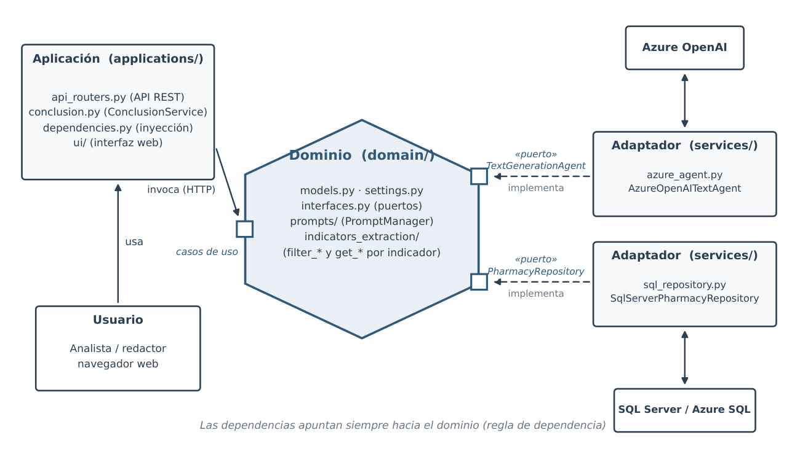
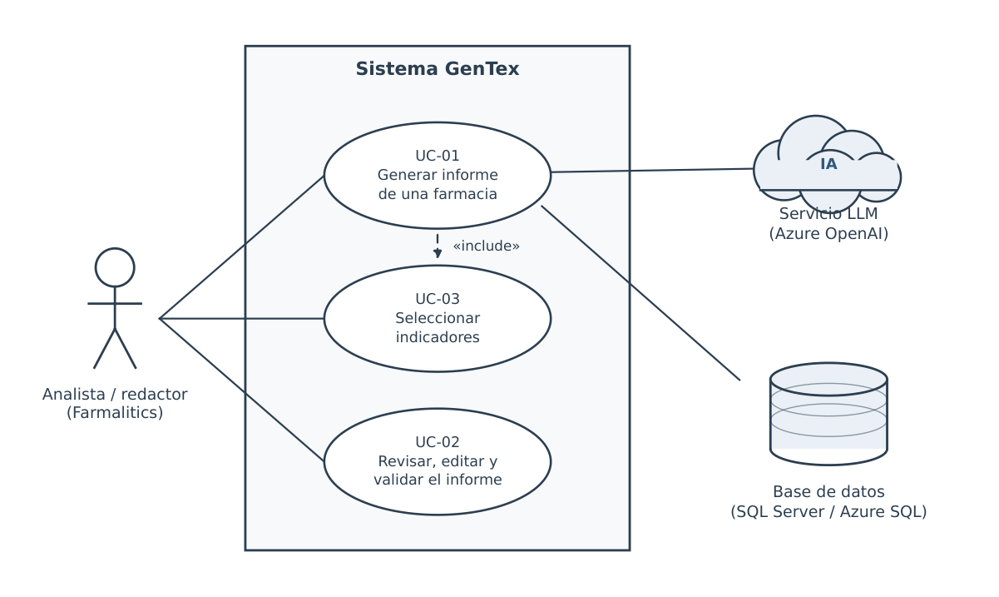
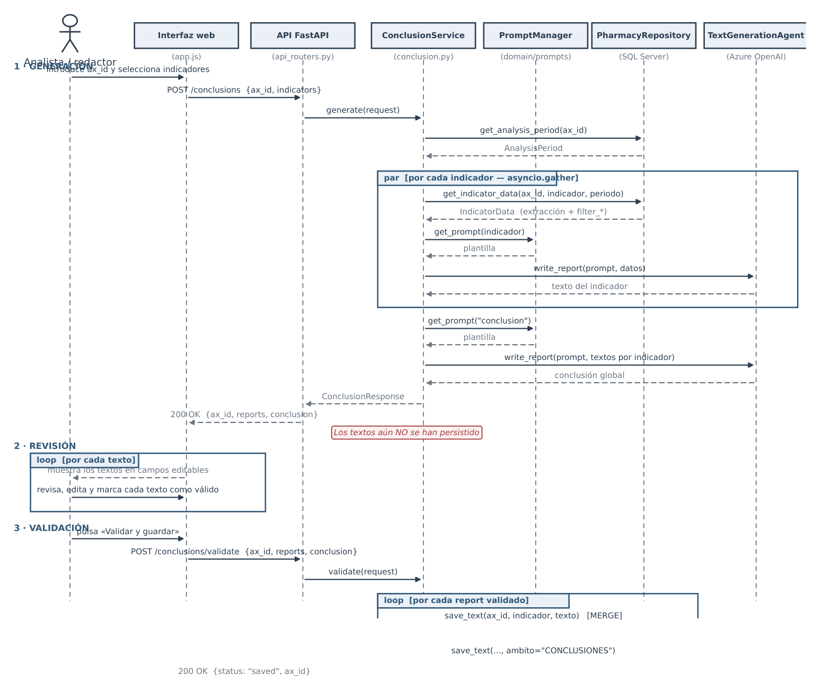
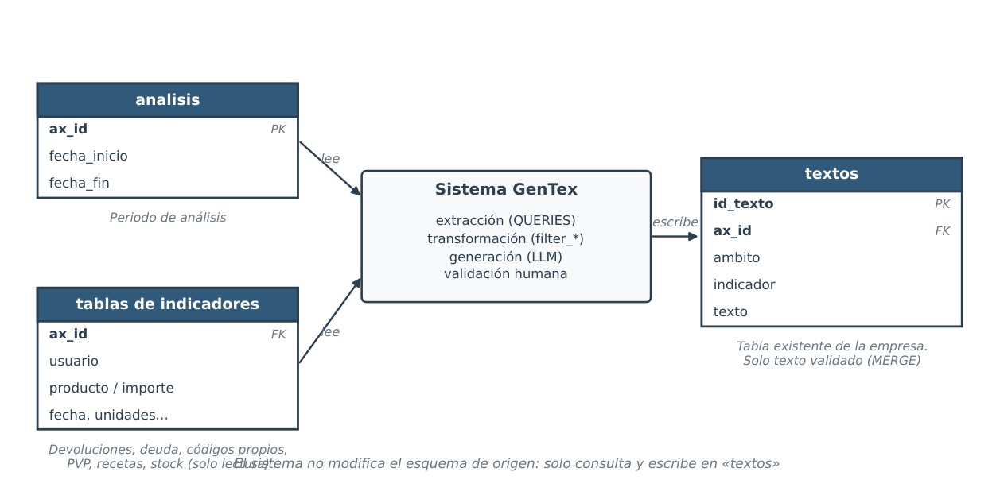
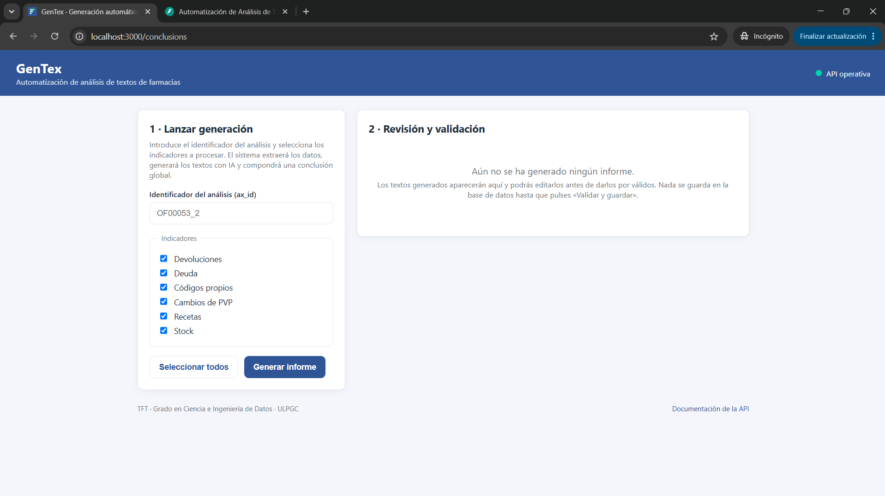
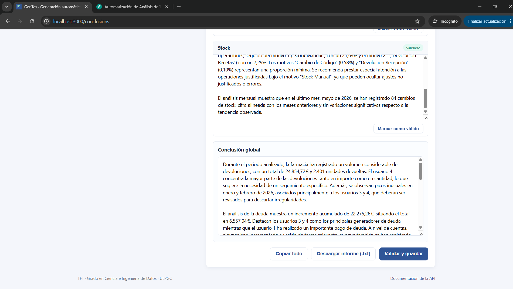
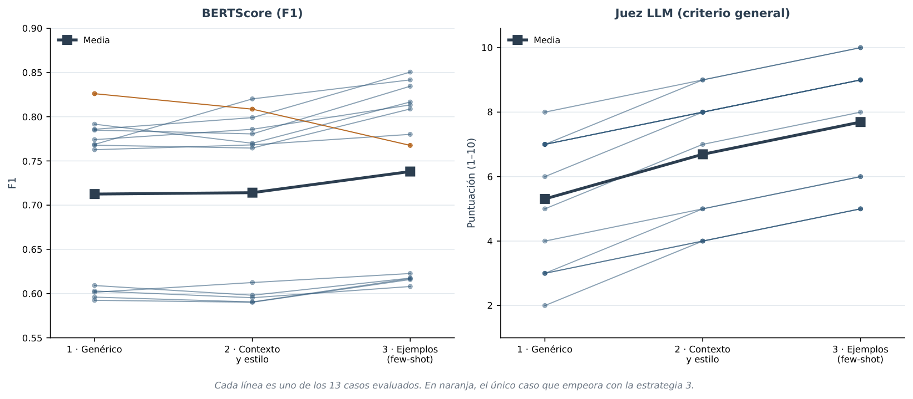
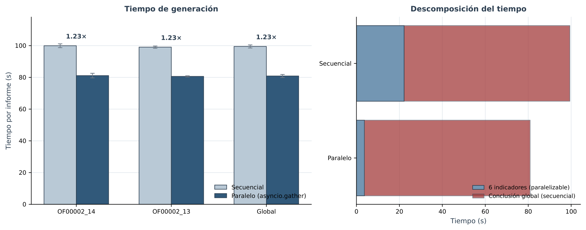
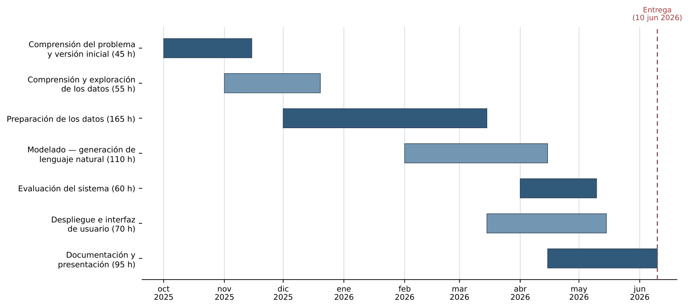

# GenTex — Generación automática de informes de farmacias

GenTex es un sistema que genera de forma automática los informes mensuales de
farmacias a partir de datos estructurados. Extrae los indicadores de negocio de
una base de datos relacional, los transforma y, mediante un modelo de lenguaje
(Azure OpenAI) y estrategias de prompting, redacta un texto por indicador y una
conclusión global. Una interfaz web permite a la persona experta revisar, editar
y validar el contenido antes de aprobarlo (flujo human-in-the-loop).

Este repositorio acompaña al Trabajo de Fin de Título del Grado en Ciencia e
Ingeniería de Datos (ULPGC).

## Arquitectura

El proyecto sigue una arquitectura hexagonal (puertos y adaptadores) organizada
en tres capas:

- `domain/`: núcleo de negocio, sin dependencias de infraestructura. Modelos,
  configuración, puertos (interfaces), plantillas de prompts y funciones de
  extracción y transformación por indicador.
- `services/`: adaptadores que implementan los puertos. Repositorio sobre SQL
  Server y agente de generación sobre Azure OpenAI.
- `applications/`: capa de entrada. Orquestación de casos de uso, API REST,
  interfaz web e inyección de dependencias.

Las dependencias apuntan siempre hacia el dominio.



El diagrama anterior muestra las tres capas y su relación con los sistemas
externos. `domain/` define dos puertos como interfaces abstractas —
`TextGenerationAgent` y `PharmacyRepository` — que no conocen ninguna
tecnología concreta. Cada puerto se implementa en un adaptador de
`services/`: `AzureOpenAITextAgent` invoca la API de Azure OpenAI por HTTP, y
`SqlServerPharmacyRepository` consulta y persiste en SQL Server / Azure SQL.
`applications/` es la capa de entrada: expone la API REST (`api_routers.py`),
orquesta el caso de uso (`conclusion.py`) e inyecta las implementaciones
concretas de los puertos (`dependencies.py`). El usuario (analista o
redactor de Farmalitics) interactúa únicamente a través de la interfaz web,
que invoca la API por HTTP. La flecha "las dependencias apuntan siempre
hacia el dominio" resume la regla de dependencia de la arquitectura
hexagonal: el dominio no importa nada de `services/` ni `applications/`, de
modo que los adaptadores (base de datos, proveedor de IA) se pueden
sustituir sin modificar la lógica de negocio.

### Casos de uso



El analista o redactor de Farmalitics es el único actor humano del sistema.
Interactúa con tres casos de uso: generar el informe de una farmacia (UC-01),
que incluye internamente la selección de los indicadores a procesar (UC-03,
relación «include»), y revisar, editar y validar el informe resultante
(UC-02). UC-01 depende del servicio LLM externo (Azure OpenAI) para redactar
los textos; UC-01 y UC-02 dependen de la base de datos (SQL Server / Azure
SQL) para leer los indicadores y persistir los textos validados,
respectivamente.

### Diagrama de secuencia



Este diagrama detalla la interacción entre los componentes en las tres fases
del flujo de trabajo:

1. **Generación**: la interfaz web envía `POST /conclusions` con el `ax_id`
   y los indicadores elegidos. `ConclusionService` obtiene el periodo de
   análisis y, para cada indicador, extrae sus datos y solicita al
   `TextGenerationAgent` que redacte el texto correspondiente; estas
   llamadas se lanzan en paralelo con `asyncio.gather`. Con los textos de
   todos los indicadores ya generados, se solicita una última redacción para
   la conclusión global. La respuesta se devuelve al navegador sin persistir
   nada en la base de datos.
2. **Revisión**: la interfaz muestra los textos en campos editables; el
   analista los revisa, edita si es necesario y los marca como válidos.
3. **Validación**: al pulsar "Validar y guardar", la interfaz envía
   `POST /conclusions/validate`, que persiste cada texto revisado mediante
   `MERGE` en la tabla `textos`.

La nota "los textos aún NO se han persistido" tras la fase de generación es
importante: el sistema separa explícitamente la generación automática de su
persistencia, de modo que ningún texto queda guardado sin haber pasado por
la revisión humana.

### Modelo de datos



GenTex no modifica el esquema de la base de datos existente de la empresa:
solo lee y escribe sobre tablas ya presentes. Lee la tabla `analisis` (que
define el periodo de un `ax_id`) y las tablas de indicadores (devoluciones,
deuda, códigos propios, PVP, recetas y stock), todas ellas en modo
solo-lectura. El único punto de escritura es la tabla `textos`, donde se
guarda —mediante `MERGE`— el texto ya validado por la persona experta,
identificado por `ax_id`, `ambito` (análisis por indicador o conclusión
global) e `indicador`.

## Requisitos previos

- Python 3.11 o superior.
- Controlador ODBC para SQL Server instalado en el sistema.
- Acceso a una base de datos SQL Server / Azure SQL.
- Un recurso de Azure OpenAI con un despliegue de modelo disponible.
- Docker (opcional, para el despliegue en contenedor).

## Instalación

```bash
git clone https://github.com/JosePerdomoDeVega/TFT_GenTex.git
cd TFT_GenTex

python -m venv .venv
source .venv/bin/activate        # En Windows: .venv\Scripts\activate

pip install -r requirements.txt
```

## Configuración

La configuración se realiza mediante variables de entorno. Copia la plantilla y
rellena tus valores:

```bash
cp .env.example .env
```

Variables disponibles:

| Variable                     | Descripción                                        |
|------------------------------|----------------------------------------------------|
| `DB_SERVER`                  | Host del servidor de base de datos.                |
| `DB_NAME`                    | Nombre de la base de datos.                        |
| `DB_USER`                    | Usuario de base de datos.                          |
| `DB_PASSWORD`                | Contraseña de base de datos.                       |
| `AZURE_OPENAI_ENDPOINT`      | Endpoint del recurso de Azure OpenAI.              |
| `AZURE_OPENAI_API_KEY`       | Clave de API del servicio.                         |
| `AZURE_OPENAI_DEPLOYMENT`    | Nombre del despliegue del modelo.                  |
| `AZURE_OPENAI_API_VERSION`   | Versión de la API de Azure OpenAI.                 |

Los secretos se gestionan solo a través de este fichero y nunca se incluyen en el
código. El fichero `.env` no debe subirse al repositorio.

## Ejecución local

```bash
uvicorn main:app --reload
```

La aplicación queda disponible en `http://localhost:8000/conclusions`.

## Despliegue con Docker

```bash
# Construir la imagen
docker build -t gentex .

# Ejecutar el contenedor cargando las variables de entorno
docker run --env-file .env -p 8000:8000 gentex
```

## Uso

El flujo de trabajo desde la interfaz web es el siguiente:

1. Acceder a `/conclusions` desde el navegador.
2. Introducir el identificador del análisis mensual (`ax_id`, que asocia una
   farmacia con su análisis de un mes) y, opcionalmente, seleccionar los
   indicadores a incluir. Sin selección se usan todos por defecto.
3. Lanzar la generación. El sistema extrae los datos, genera un texto por
   indicador y una conclusión global, y los muestra en campos editables.
4. Revisar cada bloque, editarlo si es necesario y validar el informe, que queda
   persistido.



La pantalla de generación permite introducir el `ax_id`, seleccionar los
indicadores a incluir y lanzar el proceso; los resultados aparecen agrupados
por indicador junto con la conclusión global.



Cada texto generado se muestra en un campo editable. El analista puede
corregir el contenido antes de confirmar la validación, momento en el que el
texto se persiste en la base de datos.

## API REST

| Método | Ruta                              | Descripción                                   |
|--------|-----------------------------------|-----------------------------------------------|
| GET    | `/health`                         | Comprobación del estado del servicio.         |
| GET    | `/conclusions`                    | Sirve la interfaz de usuario (HTML).          |
| POST   | `/conclusions`                    | Lanza la generación de un informe.            |
| GET    | `/applications/ui/{filename}`     | Sirve recursos estáticos (protegido).         |
| GET    | `/favicon.ico`                    | Icono de la aplicación.                       |

Ejemplo de petición a `POST /conclusions`:

```json
{
  "ax_id": 1234,
  "indicators": ["devoluciones", "deuda", "stock"]
}
```

Ejemplo de respuesta:

```json
{
  "ax_id": 1234,
  "reports": [
    {
      "indicator": "devoluciones",
      "text": "Durante el periodo analizado, las devoluciones..."
    },
    {
      "indicator": "deuda",
      "text": "La deuda acumulada muestra una variacion..."
    }
  ],
  "conclusion": "En conjunto, la farmacia presenta..."
}
```

Si el campo `indicators` se envía vacío, se emplea el conjunto por defecto
(`DEFAULT_INDICATORS`), con los seis indicadores soportados: devoluciones, deuda,
codigos_propios, pvp, recetas y stock.

## Pruebas

Las pruebas se ejecutan con pytest. La inyección de dependencias permite
sustituir el repositorio y el agente reales por dobles de prueba, de modo que se
verifica el caso de uso sin acceder a la base de datos ni al servicio de
generación.

```bash
pytest
```

| Qué se prueba                          | Cómo se prueba                                             | Resultado esperado                          |
|----------------------------------------|-----------------------------------------------------------|---------------------------------------------|
| Endpoint `POST /conclusions`           | `TestClient` con repositorio y agente simulados (mocks).  | Código 200 y respuesta con la estructura `ConclusionResponse`. |
| Orquestación de `ConclusionService`    | Doble de prueba del agente que devuelve texto fijo.       | Se genera un informe por indicador solicitado. |
| Selección por defecto de indicadores   | Petición con `indicators` vacío.                          | Se usan los seis indicadores por defecto.   |
| Aislamiento de dependencias externas   | Sobrescritura de proveedores con `dependency_overrides`.  | No se realizan llamadas reales a BD ni a Azure OpenAI. |

Además de estas pruebas funcionales, `tests/bertscore_tests.py`,
`tests/llm_tests.py` y `tests/performance_tests.py` implementan la
evaluación de calidad de los textos y del rendimiento del sistema descrita
en la siguiente sección; no se ejecutan con pytest porque requieren acceso
real a la base de datos y al servicio de generación.

## Evaluación

La calidad de los textos generados se evaluó comparando cada texto generado
por el sistema con el texto real redactado por el analista para el mismo
`ax_id` e indicador, bajo tres estrategias de prompting progresivas:
genérico (1), con contexto y estilo (2), y con ejemplos few-shot (3). Se
empleó una doble métrica: BERTScore (similitud semántica basada en
embeddings) y un juez LLM que puntúa de 1 a 10 la similitud de contenido
sobre el mismo par de textos, sin evaluar cuál de los dos es "mejor".



Cada línea representa uno de los 13 casos evaluados a lo largo de las tres
estrategias de prompting. Ambas métricas muestran una tendencia ascendente:
la estrategia con ejemplos (few-shot) obtiene, en promedio, el BERTScore F1
y la puntuación del juez LLM más altos. Solo un caso (resaltado en naranja)
empeora con la estrategia 3, lo que se investigó de forma individual como
parte del análisis cualitativo.



Sobre el rendimiento del sistema, se comparó la generación secuencial de los
seis indicadores frente a la generación en paralelo con `asyncio.gather`
(la estrategia empleada en producción por `ConclusionService`). La
paralelización reduce el tiempo total de generación de un informe en un
factor de 1.23× de media. La descomposición del tiempo muestra que la
mayor parte se concentra en la redacción de la conclusión global —que
depende de que todos los indicadores estén generados y por tanto no se
puede paralelizar—, mientras que la generación de los seis indicadores
individuales sí se beneficia de la ejecución concurrente.

## Planificación



El proyecto se organizó en siete fases siguiendo la metodología CRISP-DM,
desde la comprensión del problema y la versión inicial del código hasta la
documentación y presentación final, con entrega prevista el 10 de junio de
2026.

## Estructura del repositorio

```
GenTex/
├── main.py                    Punto de entrada; crea la app FastAPI e incluye los routers.
├── domain/                    Núcleo de negocio (modelos, puertos, configuración, prompts).
│   ├── models.py
│   ├── settings.py
│   ├── interfaces.py
│   ├── prompts/                Plantillas de prompt (PromptManager) por estrategia.
│   └── indicators_extraction/  Funciones filter_* y get_* por indicador.
├── services/                  Adaptadores que implementan los puertos del dominio.
│   ├── azure_agent.py          AzureOpenAITextAgent (Azure OpenAI).
│   └── sql_repository.py       SqlServerPharmacyRepository (SQL Server / Azure SQL).
├── applications/               Capa de entrada: API REST, casos de uso e inyección.
│   ├── api_routers.py
│   ├── conclusion.py            ConclusionService.
│   ├── dependencies.py
│   └── ui/                      Interfaz web (HTML, CSS, JS).
├── tests/                      Pruebas funcionales (pytest) y scripts de evaluación.
├── assets/                     Diagramas y figuras de la memoria (PNG).
├── Dockerfile
├── requirements.txt
├── .env.example
└── README.md
```